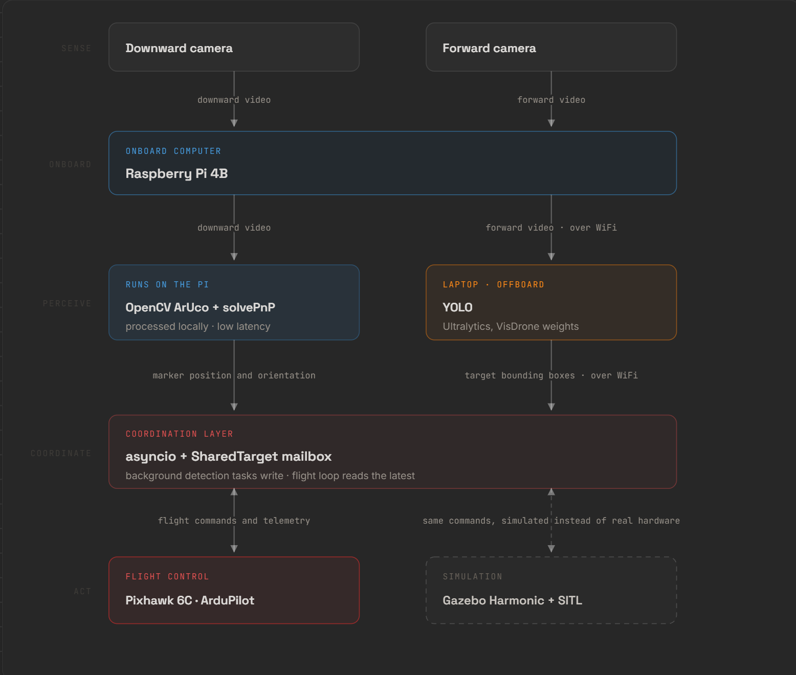
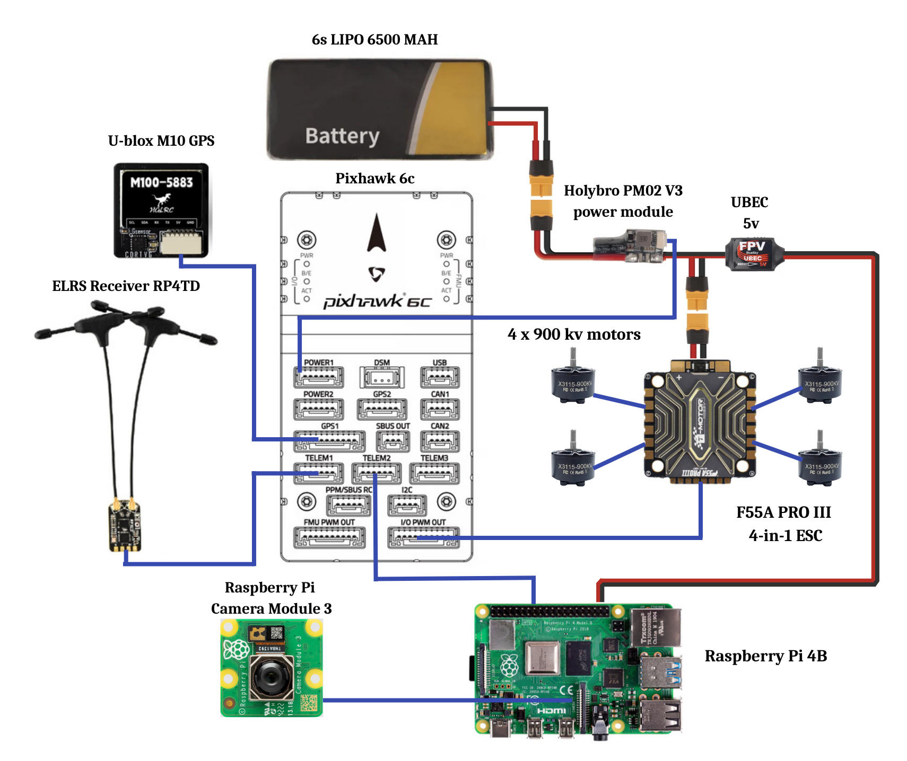

# Autonomous Multi-Tool Drone Platform

Custom-built autonomous quadrotor with vision-guided target tracking and precision landing. Designed as a modular platform for future tool payloads.

**Status:** Full autonomy stack working in simulation. Hardware bringup complete, physical flight of the full autonomy stack in progress.

**Portfolio site:** [jas.ca](https://jas.ca) · **Project page:** [jas.ca/projects/drone](https://jas.ca/projects/drone)

---

## Demo


*Full autonomy stack running in Gazebo Harmonic: the drone locates a moving truck via YOLO, tracks it in flight, then transitions to ArUco-guided precision landing on top of it.*

---

## Overview

The near-term milestone is vision-guided target tracking (YOLO) combined with precision landing on an ArUco fiducial marker, a scaled-down version of the same rendezvous and docking problem solved at much larger scale in aerospace and industrial robotics.

Development follows a simulation-first workflow: every autonomy behavior is validated in Gazebo with ArduPilot SITL before flying on hardware. The perception stack splits across two compute nodes, with latency-critical fiducial detection running on-board on a Raspberry Pi and heavier YOLO inference offloaded to a laptop over WiFi.


---

## System architecture



Both cameras feed into the Pi. The Pi forks into two processing paths: OpenCV ArUco + `solvePnP` runs locally for precision landing, while the forward camera's feed is relayed over WiFi to YOLO on a laptop for object detection. Both feed a coordination layer (asyncio + `SharedTarget`) that drives ArduPilot through MAVSDK, either on real hardware or in Gazebo SITL, same interface either way.

---


## Hardware

| Subsystem | Component |
|---|---|
| Flight controller | Pixhawk 6C running ArduCopter 4.6.3 (bdshot variant) |
| ESC | T-Motor F55A Pro III 4-in-1, DShot600 |
| Motors | T-Motor 2812 900KV × 4 |
| Battery / power | 6S LiPo, Holybro PM02 V3 power module |
| Companion compute | Raspberry Pi 4B |
| Cameras | Downward CSI (ArUco) + forward USB (YOLO) |
| GPS / compass | HGLRC M100-5883 (u-blox M10 + QMC5883P) |
| RC | RadioMaster RP4TD-M ELRS |
| Frame | Custom, PA6-CF printed arms + carbon fiber tubes |

### Electrical layout



Every wire on the drone was designed, routed, and hand-soldered from scratch. The 6S LiPo feeds the ESC and the Holybro PM02 V3 power module, which then powers the Pixhawk 6C and reports voltage and current telemetry back to it. A separate UBEC taps off the ESC power pads to run the Raspberry Pi, keeping the companion computer isolated from the flight controller's power rail. On the signal side, the ESC runs DShot600 from the Pixhawk's I/O outputs, the ELRS receiver connects on TELEM2 for CRSF control, the GPS and compass run on GPS1, and the Raspberry Pi links to the Pixhawk over MAVLink for the companion connection.

---

## Software stack

- **Language:** Python 3, asyncio
- **Flight control:** [MAVSDK-Python](https://github.com/mavlink/MAVSDK-Python) → ArduPilot over MAVLink
- **Fiducial perception:** OpenCV (contrib), ArUco + `solvePnP`
- **Object detection:** [Ultralytics YOLO](https://github.com/ultralytics/ultralytics), VisDrone weights
- **Simulation:** Gazebo Harmonic + ArduPilot SITL
- **Environment:** Ubuntu 24.04 (WSL2)

---

## How it works

The main loop lives in [`main.py`](main.py). ArUco runs inline on every downward-camera frame; YOLO runs in parallel on a background thread via `asyncio.to_thread` so its inference doesn't block the event loop. Both write into a `SharedTarget` mailbox with thread-safe locking. The flight loop reads from the mailbox and either follows a scripted path or switches into vision-driven tracking the moment a target appears. ArUco takes priority when a marker is visible, and YOLO is the fallback for wider-area target acquisition. Body-frame velocity commands go to ArduPilot via MAVSDK offboard, with per-axis gains and clamps in `tvec_to_body_velocity`. Landing gates on both centering tolerance and altitude before handing off to `drone.action.land()`.

---

## Key engineering decisions

**Two-node perception split.** Both cameras physically connect to the Pi first, since it's the only board with camera inputs. ArUco stays local because precision landing needs low, predictable latency, and sending frames off-board to another machine over WiFi introduces delays that make it infeasible. YOLO gets offloaded because the Pi can't run it in real time and a laptop can. This split matches the compute-partitioning pattern used on production autonomous drones.

**Simulation-first workflow.** The full autonomy stack was developed and validated in Gazebo with a custom drone model, a downward-facing camera calibrated to match the planned hardware, and a moving vehicle target with an ArUco marker attached. Zero crash risk during iteration, and every behavior transfers cleanly to hardware because MAVSDK, ArduPilot, and the perception code are identical between sim and real.

---

## Running the code

**Prerequisites:** Ubuntu 24.04 (or WSL2), Gazebo Harmonic, ArduPilot SITL, Python 3.10+, a calibrated downward camera model (see [`sim.yaml`](sim.yaml))

**Install:**
```bash
python -m venv venv --system-site-packages
source venv/bin/activate
pip install -r requirements.txt
```

The `--system-site-packages` flag is needed to access the system-installed `gz-transport13` bindings.

**Launch SITL + Gazebo:**
```bash
gz sim iris_runway.sdf              # terminal 1
sim_vehicle.py -v ArduCopter -f gazebo-iris --model JSON --map --console   # terminal 2
```

**Run:**
```bash
python main.py
```

The drone runs pre-flight checks, arms, takes off, executes scripted flight, and transitions to tracking the moment ArUco or YOLO detects a target.

---

## What's next

**ROS2 migration.** The current asyncio + `SharedTarget` coordination works for one target and two vision sources, but adding a second downward camera, a tool-mount sensor, and eventually LiDAR quickly makes it harder to manage. What the current setup does with hand-rolled shared state is essentially a manual version of what ROS2 does natively: typed messages between nodes, `rosbag` for offline log replay, and DDS handling transport between the Pi and laptop. Migration is the natural next step.

**Modular tool mount.** GX-series connector system to let the same airframe carry different payloads (grippers, sensors, delivery mechanisms) without rewiring.

**Outdoor autonomy testing.** Closed-loop autonomous flight on hardware.

---

## Related

- **Portfolio site:** [jas.ca](https://jas.ca), full project write-up with photos and video
- **Learning experiments:** [github.com/JaskaranspPabla/cv-flight-experiments](https://github.com/JaskaranspPabla/cv-flight-experiments), practice code from working through OpenCV, YOLO, and MAVSDK

---

## License

MIT
